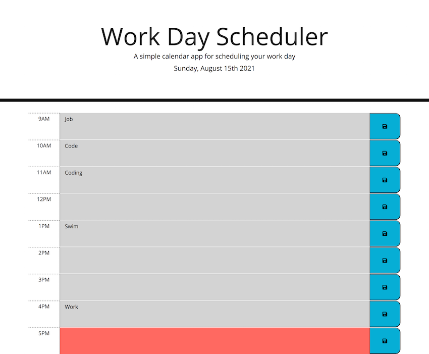

# Plan-your-day

A useful application to schedule activities during a typical 9-5 day. 

Hourly blocks are based on past (light grey), present (red) and future (green.)

Plans can be entered and saved with the blue icon, which saves user inputs after refreshing the page. 

Created on the following user story:
```md
GIVEN I am using a daily planner to create a schedule
WHEN I open the planner
THEN the current day is displayed at the top of the calendar
WHEN I scroll down
THEN I am presented with timeblocks for standard business hours
WHEN I view the timeblocks for that day
THEN each timeblock is color coded to indicate whether it is in the past, present, or future
WHEN I click into a timeblock
THEN I can enter an event
WHEN I click the save button for that timeblock
THEN the text for that event is saved in local storage
WHEN I refresh the page
THEN the saved events persist
```

## Working links
* Repo : https://github.com/mz0121coder/Plan-your-day/
* Main URL: https://mz0121coder.github.io/Plan-your-day/

## Screenshot

